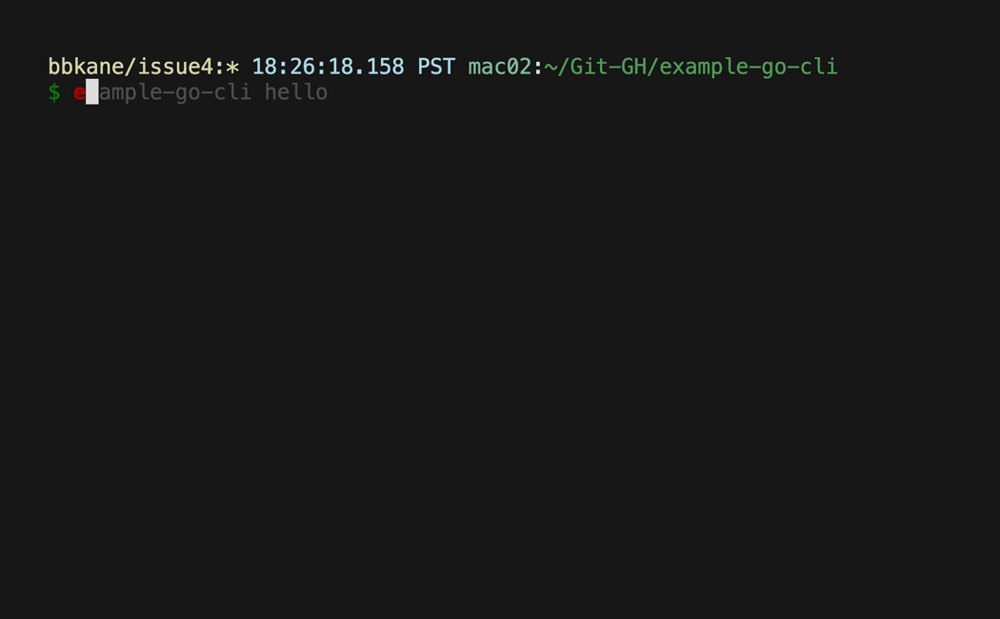

# example-go-cli

An example go CLI to demo and learn new Go tooling!

## Project status (2025-06-13)

I use `example-go-cli` to test CI/CD, so it's not really useful to anyone else.

## Convert to a new project

See [Go Project Notes](https://www.bbkane.com/blog/go-project-notes/#creating-a-new-go-project).

## Use



```bash
example-go-cli hello
```

## Install

- [Homebrew](https://brew.sh/): `brew install bbkane/tap/example-go-cli`
- [Scoop](https://scoop.sh/):

```
scoop bucket add bbkane https://github.com/bbkane/scoop-bucket
scoop install bbkane/example-go-cli
```

- Download Mac/Linux/Windows executable: [GitHub releases](https://github.com/bbkane/example-go-cli/releases)
- Go: `go install go.bbkane.com/example-go-cli@latest`
- Build with [goreleaser](https://goreleaser.com/) after cloning: `goreleaser release --snapshot --clean`

## Manual release validation

Use these steps to validate the generated Homebrew cask locally.

Notes:

- `brew style` and `brew audit` currently reject arbitrary cask file paths and expect a cask name in a tap.
- Some output formatting from generated files may be autocorrectable by Homebrew style tools.
- `brew audit` may enable Homebrew developer mode automatically.
- A local-only cask install test is not supported by this config: generated cask URLs point to GitHub release assets.

```bash
# 1) Regenerate artifacts from current config.
goreleaser release --snapshot --clean --skip=publish

# Cask is written to dist/homebrew/Casks/example-go-cli.rb.

# 2) Create a temporary local tap (one-time).
brew tap-new bbkane/localtest

# 3) Copy generated cask into the local tap.
mkdir -p "$(brew --repository)/Library/Taps/bbkane/homebrew-localtest/Casks"
cp dist/homebrew/Casks/example-go-cli.rb "$(brew --repository)/Library/Taps/bbkane/homebrew-localtest/Casks/example-go-cli.rb"

# 4) Run Homebrew lint/style checks.
brew style --cask bbkane/localtest/example-go-cli
brew audit --cask --strict --online bbkane/localtest/example-go-cli

# 5) Cleanup temporary tap.
brew untap bbkane/localtest

# 6) If audit enabled Homebrew developer mode, turn it back off.
brew developer off
```

## Notes

See [Go Project Notes](https://www.bbkane.com/blog/go-project-notes/) for notes on development tooling.
